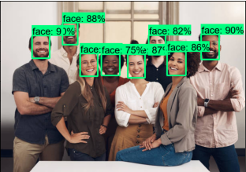
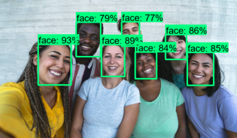
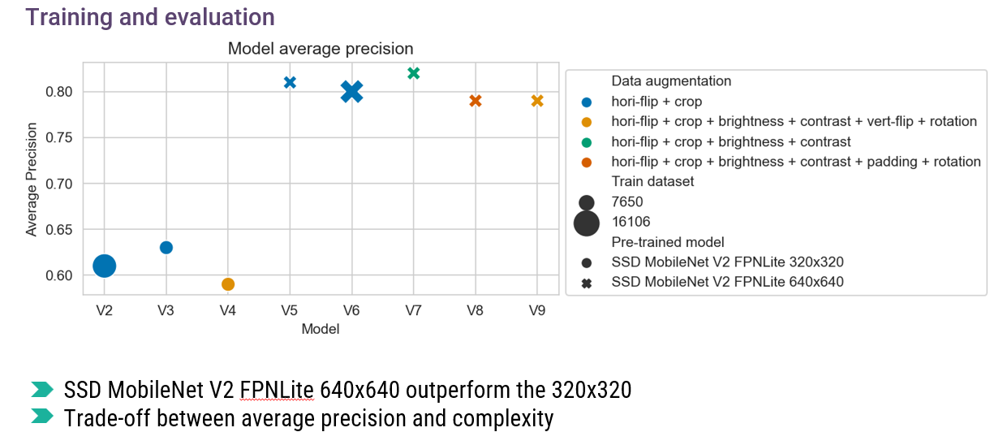

# Face detection using TensorFlow
- This repository contains codes to fine-tune, run inference and export your face detection model 😃. 
- In this example, we use the pre-trained model [ssd_mobilenet_v2_fpnlite_640x640_coco17_tpu-8](http://download.tensorflow.org/models/object_detection/tf2/20200711/ssd_mobilenet_v2_fpnlite_640x640_coco17_tpu-8.tar.gz). 

- Here are some inference on the model fine-tuned on the [WIDER FACE dataset](http://shuoyang1213.me/WIDERFACE/)

- Several fined tuned model was made using different pre-trained, datasets and data augmentation.

- It also contain a script for converting the trained model to Tensorflow Lite. The TFLite modelV7 was deployed on Android in [this repository](https://github.com/allankouidri/Face_Detection_Android_App) 📱. 

## Steps
 
<b>Step 1.</b> Clone this repository: https://github.com/allankouidri/Face_detection_MobiNetV2_TF
  
<b>Step 2.</b> Create a new virtual environment 
<pre>
python -m venv tfod
</pre> 
 
<b>Step 3.</b> Activate your virtual environment (avoid using conda)
<pre>
source tfod/bin/activate # Linux
.\tfod\Scripts\activate # Windows 
</pre>
 
<b>Step 4.</b> Install dependencies and add virtual environment to the Python Kernel
<pre>
python -m pip install --upgrade pip
pip install ipykernel
python -m ipykernel install --user --name=tfodj
pip install -r requirements.txt
</pre>
 
<b>Step 5.</b> Collect images using the Notebook <a href="https://github.com/allankouidri/Face_detection_MobiNetV2_TF/blob/main/Image_labelling.ipynb">1. Image Collection.ipynb</a> - ensure you change the kernel to the virtual environment as shown below
 
 
<b>Step 6.</b> Manually divide collected images into two folders train and test. So now all folders and annotations should be split between the following two folders.  
\TFODCourse\Tensorflow\workspace\images\train 
\TFODCourse\Tensorflow\workspace\images\test
  
<b>Step 7.</b> Begin training process by opening <a href="https://github.com/allankouidri/Face_detection_MobiNetV2_TF/blob/main/Fine-tuning_detection_export.ipynb">2. Fine-tuning_detection_export.ipynb</a>, this notebook will walk you through installing Tensorflow Object Detection, making detections, saving and exporting your model. 
  
<b>Step 8.</b> During this process the Notebook will install Tensorflow Object Detection. You should ideally receive a notification indicating that the API has installed successfully at Step 8 with the last line stating OK.  

If not, resolve installation errors by referring to the <a href="https://github.com/allankouidri/Face_detection_MobiNetV2_TF/blob/main/Error%20Guide.md">Error Guide.md</a> in this folder.
   
<b>Step 9.</b> Once you get to step 6. Train the model, inside of the notebook, you may choose to train the model from within the notebook. I have noticed however that training inside of a separate terminal on a Windows machine you're able to display live loss metrics. 
 
 
<b>Step 10.</b> You can optionally evaluate your model inside of Tensorboard. Once the model has been trained and you have run the evaluation command under Step 7. Navigate to the evaluation folder for your trained model e.g. 
<pre> cd Tensorlfow/workspace/models/my_ssd_mobnet/eval</pre> 
and open Tensorboard with the following command
<pre>tensorboard --logdir=. </pre>
Tensorboard will be accessible through your browser and you will be able to see metrics including mAP - mean Average Precision, and Recall.
 
